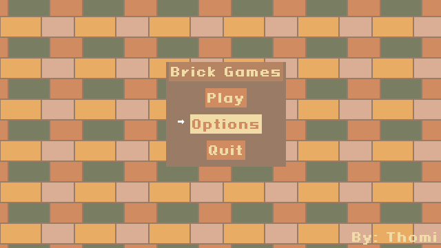

## Cake Defender
A tower defense game in the prototype stage. Made with C and Raylib.

 

## [CucumberBatch](https://xinove.itch.io/detective-cucumberbatch)
A mixture of detective games, visual novels and puzzle games. Made in Godot.

You can play the prototype: [xinove.itch.io/detective-cucumberbatch.](https://xinove.itch.io/detective-cucumberbatch)

 

## [BrickGames](https://xinove.itch.io/brick-games)
Collection of little games made to learn game programming with C and Raylib. Has Tetris, snake, breakout, and pong clones.
 
Very rough on the edges, but I learned a lot doing this project. 
  
The source is available here: [github.com/xinove1/raylib-brick-games.](https://github.com/xinove1/raylib-brick-games)
 
And you can play it here: [xinove.itch.io/brick-games.](https://xinove.itch.io/brick-games)
 

  
  

 

## 42 Projects
Some projects made while a student at 42:
- [Minishell](https://github.com/xinove1/minihell) (not finished) a shell.
- [Push Swap](https://github.com/xinove1/push_swap) Sort numbers on two stacks with a pre-defined number of possible operations.
- [So long](https://github.com/xinove1/so_long) Simple graphical project.
- [Pipex](https://github.com/xinove1/pipex) Imitate the piping functionality of the shell.
-  Minitalk Communication of two processes using signals.
-  BornToBeRoot Set up a linux server.
- [Printf](https://github.com/xinove1/printf) Imitate basic printf functionality.
- [Get next line](https://github.com/xinove1/get_next_line) Utility function to get the next line in a file descriptor.
- [Libft](https://github.com/xinove1/libft) Base lib used in most 42 projects, imitates some std funcs and extends others.
